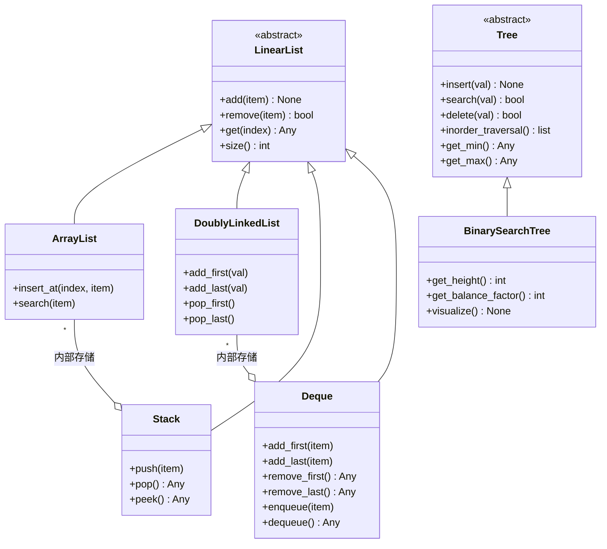

# PyDSAI

[](https://github.com/gorgeoustrouble10-maker/PyDSAI-Arch-Python/actions/workflows/ci.yml)
[](https://www.python.org/)
[](LICENSE)
[](https://mypy.readthedocs.io/)
[](https://github.com/psf/black)

> **Industrial-grade Data Structures & Algorithms Library in Python.**  
> Engineered for memory efficiency, thread-safety, and robust iterative logic.
>
> **工业级 Python 数据结构与算法库。** 专为内存效率、线程安全及高鲁棒性迭代逻辑而设计。

---

AI 赋能的数据结构与算法实现。  
**AI を活用したデータ構造・アルゴリズム実装**

---

## 项目架构 (Project Architecture)



---

## Performance & Memory Summary

性能与内存实测汇总 / 性能・メモリ実測サマリ

| 类型 | 指标 | ArrayList | LinkedList | BST | Deque |
|------|------|-----------|------------|-----|-------|
| **性能** | Search (20K, 100 次) | 59.23 ms O(n) | — | 70.67 ms O(log n) | — |
| | Insert at head (20K 次) | 10,284 ms O(n) | — | — | 19 ms O(1) |
| | Full iteration (20K) | 28.33 ms | 1.88 ms | — | — |
| **内存 (Bytes)** | 10,000 元素 | 362,116 | 840,140 | 840,140 | — |
| | 50,000 元素 | 2,055,556 | 4,200,140 | 4,200,140 | — |

> **结论**：先头插入场景下，Deque 比 ArrayList 快约 **540 倍**；ArrayList 在同等元素下内存占用约为 LinkedList/BST 的 **40%**。

---

## 项目结构

```
PyDSAI/
├── src/pydsai/       # 核心库
├── tests/            # 单元测试
├── examples/         # 性能与内存审计脚本
├── docs/             # 文档
└── README.md
```

## 开发环境

- Python 3.11+
- Black (line length 88)
- mypy strict mode
- pytest + pytest-cov

## 安装

```bash
pip install -r requirements.txt
```

## 使用

```python
import pydsai

print(pydsai.__version__)

# BST 可视化
from pydsai import BinarySearchTree
bst = BinarySearchTree()
for v in [50, 30, 70, 20, 40, 60, 80]:
    bst.insert(v)
bst.visualize()   # 打印树状结构
print(bst.get_height(), bst.get_balance_factor())
```

## 文档

- [计算量参考](docs/COMPLEXITY.md)
- [基准测试结果](docs/BENCHMARK_RESULTS.md)
- [GitHub 新账号设置教程](docs/GITHUB_SETUP.md)
