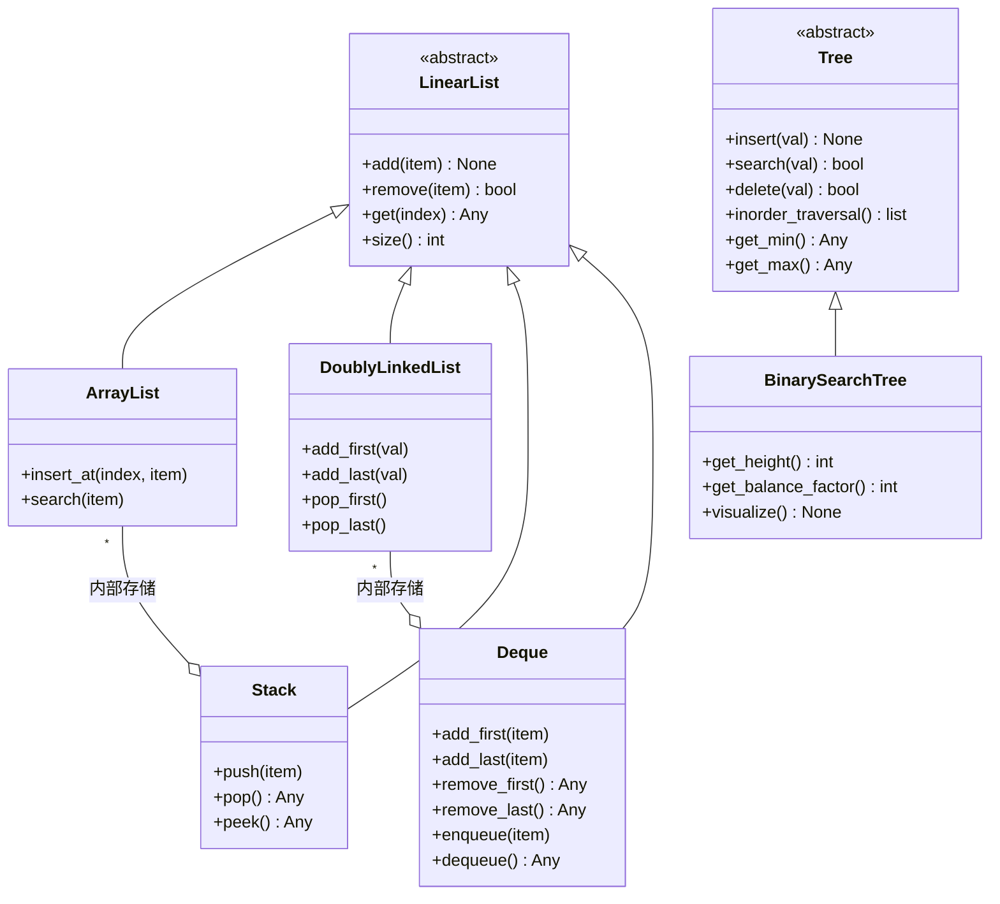

# PyDSAI

[](https://github.com/gorgeoustrouble10-maker/PyDSAI-Arch-Python/actions/workflows/ci.yml)
[](https://www.python.org/)
[](LICENSE)
[](https://mypy.readthedocs.io/)
[](https://github.com/psf/black)

> **Industrial-grade Data Structures & Algorithms Library in Python.**  
> Engineered for memory efficiency, thread-safety, and robust iterative logic.
>
> **工业级 Python 数据结构与算法库。** 专为内存效率、线程安全及高鲁棒性迭代逻辑而设计。

---

## 目录 | 目次

- [① 项目概要](#①-项目概要project-overview)
- [② 数据结构一览](#②-数据结构一览)
- [③ 设计思想](#③-设计思想design-philosophy)
- [④ 项目特色（工业级审计）](#④-项目特色工业级审计)
- [⑤ 时间与空间复杂度](#⑤-时间与空间复杂度)
- [⑥ 项目架构](#⑥-项目架构project-architecture)
- [⑦ 性能与内存汇总](#⑦-性能与内存汇总)
- [⑧ 环境与使用](#⑧-环境与使用usage)
- [⑨ 质量保障](#⑨-质量保障)
- [⑩ 未来展望](#⑩-未来展望future-work)
- [文档与参考](#文档与参考)

---

## ① 项目概要（Project Overview）

PyDSAI 是面向 AI 时代的数据结构与算法 Python 库。贯彻**契约式设计（Design by Contract）**、**组合优于继承（Composition over Inheritance）**、**线程安全**，保障企业级品质。

PyDSAI は、AI 時代のデータ構造とアルゴリズムを体系的に実装した Python ライブラリである。

---

## ② 数据结构一览

| 数据结构 | 英文名 | 特点 |
|----------|--------|------|
| **动态数组** | ArrayList | 连续内存、O(1) 索引访问、容量倍增、线程安全 |
| **双向链表** | DoublyLinkedList | 头尾 O(1) 插入/删除、head/tail 指针、`__slots__` 节内存、线程安全 |
| **二分搜索树** | BinarySearchTree | O(log n) 搜索/插入/删除、中序遍历升序、迭代式实现、`get_height`/`get_balance_factor`/`visualize`、线程安全 |
| **栈** | Stack | LIFO、基于 ArrayList 组合、push/pop/peek |
| **双端队列** | Deque | 两端 O(1) 操作、基于 DoublyLinkedList 组合、Queue 模式（enqueue/dequeue）与 Stack 模式（push/pop） |

> **说明**：Queue 的 FIFO 操作通过 Deque 的 `enqueue` / `dequeue` 实现。

---

## ③ 设计思想（Design Philosophy）

### 3.1 契约式设计（Design by Contract）

**实现**：通过 `abc` 定义 `LinearList` 抽象基类，将 `add`、`remove`、`get`、`size` 作为契约。ArrayList、DoublyLinkedList、Stack、Deque 均实现该接口。

**优势**：实现可替换而调用方无需修改，扩展性与可测试性提升，符合依赖倒置原则（DIP）。

### 3.2 组合优于继承（Composition over Inheritance）

**实现**：Stack 内部持有 ArrayList，Deque 内部持有 DoublyLinkedList，通过组合实现。

**优势**：保持类层次扁平，职责分离，提高复用性，体现 GoF 中「组合的灵活性」。

### 3.3 线程安全设计（Thread-Safe Design）

**实现**：ArrayList、DoublyLinkedList、BinarySearchTree 使用 `threading.Lock` 保护所有读写。`pop_last`、`peek_last`、`delete` 等多步操作在单一锁内完成，避免竞态。

**优势**：多线程下数据一致，降低死锁风险。迭代器采用「锁内快照 + 锁外 yield」，避免持锁迭代导致死锁。

---

## ④ 项目特色（工业级审计）

| 特性 | 说明 |
|------|------|
| **`__slots__` 内存优化** | Node、_TreeNode 使用 `__slots__`，大量节点时显著减少内存 |
| **BST 迭代式实现** | insert、delete、`_height_unsafe`、`_visualize_unsafe`、中序迭代器均为迭代实现，避免退化树 RecursionError |
| **死锁规避** | `ArrayList.__iter__`、`DoublyLinkedList.__iter__`、`BST.__iter__` 均采用「锁内快照 + 锁外 yield」 |
| **异常规范** | 空容器 pop/remove 统一抛出 `IndexError` |
| **Pythonic 协议** | `__iter__`、`__getitem__`、`__len__`、`__contains__` 完整支持 |

---

## ⑤ 时间与空间复杂度

详见 [docs/COMPLEXITY.md](docs/COMPLEXITY.md)，主要操作如下：

| 数据结构 | 操作 | 时间复杂度 | 空间复杂度 |
|----------|------|------------|------------|
| **ArrayList** | 索引访问（get） | O(1) | O(n) |
| | 末尾插入（add） | O(1) 均摊 | O(n) |
| | 头插/头删 | O(n)* | O(n) |
| | 按值搜索 | O(n) | O(n) |
| **DoublyLinkedList** | 索引访问（get） | O(n) | O(n) |
| | 头尾插入/删除 | O(1) | O(n) |
| | 按值搜索 | O(n) | O(n) |
| **Stack** | push / pop / peek | O(1) | O(n) |
| **Deque** | add_first / add_last / remove_first / remove_last / peek | O(1) | O(n) |
| | 索引访问（get） | O(n) | O(n) |
| **BinarySearchTree** | insert / search / delete | O(log n) 均 / O(n) 最坏 | O(n) |

\* ArrayList 头操作因元素移位为 O(n)。

---

## ⑥ 项目架构（Project Architecture）



---

## ⑦ 性能与内存汇总

| 类型 | 指标 | ArrayList | LinkedList | BST | Deque |
|------|------|-----------|------------|-----|-------|
| **性能** | Search (20K, 100 次) | 59.23 ms O(n) | — | 70.67 ms O(log n) | — |
| | Insert at head (20K 次) | 10,284 ms O(n) | — | — | 19 ms O(1) |
| | Full iteration (20K) | 28.33 ms | 1.88 ms | — | — |
| **内存 (Bytes)** | 10,000 元素 | 362,116 | 840,140 | 840,140 | — |
| | 50,000 元素 | 2,055,556 | 4,200,140 | 4,200,140 | — |

> **结论**：头插场景下，Deque 比 ArrayList 快约 **540 倍**；ArrayList 同等元素下内存约为 LinkedList/BST 的 **40%**。

---

## ⑧ 环境与使用（Usage）

### 8.1 运行环境

- **Python**：3.11 及以上
- **依赖**：pytest、black、mypy、pytest-cov（见 `requirements.txt`）

### 8.2 安装

```bash
pip install -r requirements.txt
```

### 8.3 示例代码

```python
from pydsai import ArrayList, DoublyLinkedList, Stack, Deque, BinarySearchTree

# --- ArrayList：动态数组 ---
arr = ArrayList()
arr.add(1)
arr.add(2)
print(arr[0])  # 1

# --- DoublyLinkedList：双向链表 ---
dll = DoublyLinkedList()
dll.add_first(1)
dll.add_last(2)
print(list(dll))  # [1, 2]

# --- Stack：栈（LIFO）---
stack = Stack()
stack.push(1)
stack.push(2)
print(stack.pop())  # 2

# --- Deque：Queue 模式（FIFO）---
queue = Deque()
queue.enqueue(1)
queue.enqueue(2)
print(queue.dequeue())  # 1

# --- Deque：Stack 模式（LIFO）---
stack2 = Deque()
stack2.push(1)
stack2.push(2)
print(stack2.pop())  # 2

# --- BinarySearchTree：BST 可视化 ---
bst = BinarySearchTree()
for v in [50, 30, 70, 20, 40, 60, 80]:
    bst.insert(v)
bst.visualize()
print(bst.get_height(), bst.get_balance_factor())
print(50 in bst)  # True，支持 __contains__
print(list(bst))  # 中序迭代 [20, 30, 40, 50, 60, 70, 80]
```

### 8.4 性能基准测试

```bash
python examples/performance_benchmark.py
```

输出保存至 `benchmark_report.txt`。

### 8.5 内存审计

```bash
python examples/memory_usage_audit.py
```

---

## ⑨ 质量保障

| 项目 | 现状 |
|------|------|
| **单元测试** | **52** 个用例（边界、空状态、并发、BST 退化树等）全部通过 |
| **代码格式** | Black（line length 88） |
| **类型检查** | mypy strict mode，全方法类型注解 |
| **文档** | Javadoc 风格 docstring（中英日） |

---

## ⑩ 未来展望（Future Work）

- **平衡 BST（AVL / 红黑树）**：消除 BST 最坏 O(n) 退化，保证 O(log n)
- **Read-Write Lock**：读多场景下提升并发
- **优先队列（Priority Queue）**：堆实现
- **哈希表（Hash Table）**：O(1) 期望时间搜索/插入/删除

---

## 线程安全审计（Thread-Safety Audit）

采用**实例级锁（per-instance lock）**：

1. **排他范围清晰**：每个实例独立 `threading.Lock`，不同实例无锁竞争
2. **避免死锁**：单一锁，无多锁顺序问题
3. **原子性**：`pop_last`、`peek_last`、`delete` 等均在锁内完成

---

## 面试亮点

### CPU 缓存优化

ArrayList 使用**连续内存**，利用**空间局部性**。CPU 加载缓存行（约 64 字节）时，相邻元素一并进入缓存，顺序访问命中率高。LinkedList 节点分散，随机访问多，缓存未命中增加。详见 [docs/COMPLEXITY.md](docs/COMPLEXITY.md)。

### 架构设计

- **LinearList 抽象**：接口契约，便于替换与扩展
- **组合**：Stack、Deque 按需组合 ArrayList、DoublyLinkedList，避免过度继承

### 线程安全

基底结构使用 `threading.Lock` 保护所有操作。`pop`、`peek` 等多步操作在单一锁内完成，避免中间状态暴露。

---

## 文档与参考

- [日本語版 README](README_JP.md) | Japanese README
- [计算量参考](docs/COMPLEXITY.md)
- [基准测试结果](docs/BENCHMARK_RESULTS.md)
- [项目复盘](docs/RETROSPECTIVE.md)
- [README 更新审计](docs/README_AUDIT.md)
- [GitHub 新账号设置](docs/GITHUB_SETUP.md)
- **版本**：0.1.0
