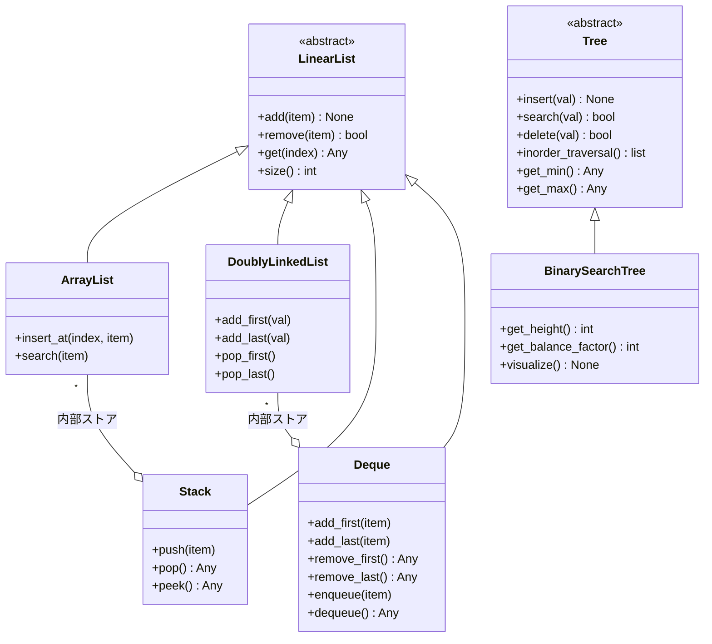

# PyDSAI

[](https://github.com/gorgeoustrouble10-maker/PyDSAI-Arch-Python/actions/workflows/ci.yml)
[](https://www.python.org/)
[](LICENSE)
[](https://mypy.readthedocs.io/)
[](https://github.com/psf/black)

> **Industrial-grade Data Structures & Algorithms Library in Python.**  
> Engineered for memory efficiency, thread-safety, and robust iterative logic.
>
> **工業級 Python データ構造・アルゴリズムライブラリ。** メモリ効率・スレッドセーフ・高ロバスト性のイテラティブ実装を追求。

---

## 目次 | 目次

- [① プロジェクト概要](#①-プロジェクト概要project-overview)
- [② データ構造一覧](#②-データ構造一覧)
- [③ 設計思想](#③-設計思想design-philosophy)
- [④ プロジェクト特色（工業級監査）](#④-プロジェクト特色工業級監査)
- [⑤ 時間・空間計算量](#⑤-時間と空間計算量)
- [⑥ プロジェクトアーキテクチャ](#⑥-プロジェクトアーキテクチャproject-architecture)
- [⑦ パフォーマンス・メモリサマリ](#⑦-パフォーマンスとメモリサマリ)
- [⑧ 環境と使い方](#⑧-環境と使い方usage)
- [⑨ 品質保証](#⑨-品質保証)
- [⑩ 今後の展望](#⑩-今後の展望future-work)
- [ドキュメント・参照](#ドキュメントと参照)

---

## ① プロジェクト概要（Project Overview）

PyDSAI は、AI 時代のデータ構造とアルゴリズムを体系的に実装した Python ライブラリである。**契約による設計（Design by Contract）**、**継承より合成（Composition over Inheritance）**、**スレッドセーフ**を徹底し、企業級の品質を担保している。

PyDSAI is an industrial-grade Python library for data structures and algorithms in the AI era.

---

## ② データ構造一覧

| データ構造 | 英語名 | 特徴 |
|-----------|--------|------|
| **動的配列** | ArrayList | 連続メモリ配置、O(1) インデックスアクセス、容量倍増による動的拡張、スレッドセーフ |
| **双方向連結リスト** | DoublyLinkedList | 先頭・末尾 O(1) 挿入・削除、head/tail ポインタ管理、`__slots__` によるメモリ節約、スレッドセーフ |
| **二分探索木** | BinarySearchTree | O(log n) 検索・挿入・削除、中順走査で昇順取得、イテラティブ実装、`get_height`/`get_balance_factor`/`visualize`、スレッドセーフ |
| **スタック** | Stack | LIFO（後入れ先出し）、ArrayList を内部ストアに合成、push/pop/peek 提供 |
| **デック（両端キュー）** | Deque | 両端 O(1) 操作、DoublyLinkedList を内部に合成、Queue モード（enqueue/dequeue）・Stack モード（push/pop）に対応 |

> **補足**：Queue（キュー）の FIFO 操作は、Deque の `enqueue` / `dequeue` により実現している。

---

## ③ 設計思想（Design Philosophy）

### 3.1 契約による設計（Design by Contract）

**実装**：`abc` モジュールにより `LinearList` 抽象基底クラスを定義し、`add`・`remove`・`get`・`size` の 4 メソッドを契約として明示している。ArrayList、DoublyLinkedList、Stack、Deque はすべて `LinearList` を実装している。

**メリット**：実装を差し替えても呼び出し側の変更が不要となり、拡張性とテスタビリティが向上する。依存性逆転の原則（DIP）に沿った設計である。

### 3.2 継承より合成（Composition over Inheritance）

**実装**：Stack は内部で ArrayList を、Deque は DoublyLinkedList を保持する「合成」により実装している。

**メリット**：クラス階層を浅く保ちつつ、責務の分離と再利用性を高めている。GoF のデザインパターンにおける「合成による柔軟性」の実践である。

### 3.3 スレッドセーフ設計（Thread-Safe Design）

**実装**：ArrayList、DoublyLinkedList、BinarySearchTree は `threading.Lock` によりすべての読み書き操作を保護している。`pop_last`・`peek_last`・`delete` など複数ステップを要する操作は、単一ロック内で完了する原子的操作として実装し、競合状態を排除している。

**メリット**：マルチスレッド環境でもデータの整合性が保たれ、デッドロックのリスクを抑える。イテレータは「ロック内スナップショット + ロック外 yield」を採用し、ロック保持中のイテレーションによるデッドロックを回避している。

---

## ④ プロジェクト特色（工業級監査）

| 項目 | 内容 |
|------|------|
| **`__slots__` メモリ最適化** | Node、_TreeNode で `__slots__` を使用し、大量ノード時のメモリを大幅削減 |
| **BST イテラティブ実装** | insert、delete、`_height_unsafe`、`_visualize_unsafe`、中順イテレータはいずれもイテラティブ実装で、退化木でも RecursionError を回避 |
| **デッドロック回避** | `ArrayList.__iter__`、`DoublyLinkedList.__iter__`、`BST.__iter__` は「ロック内スナップショット + ロック外 yield」を採用 |
| **例外規範** | 空コンテナの pop/remove は一貫して `IndexError` を送出 |
| **Pythonic プロトコル** | `__iter__`、`__getitem__`、`__len__`、`__contains__` を完全サポート |

---

## ⑤ 時間・空間計算量

詳細は [docs/COMPLEXITY.md](docs/COMPLEXITY.md) を参照。主要操作の計算量は以下の通り。

| データ構造 | 操作 | 時間計算量 | 空間計算量 |
|-----------|------|-----------|-----------|
| **ArrayList** | インデックスアクセス（get） | O(1) | O(n) |
| | 末尾挿入（add） | O(1) 償却 | O(n) |
| | 先頭挿入・削除 | O(n)* | O(n) |
| | 値による検索 | O(n) | O(n) |
| **DoublyLinkedList** | インデックスアクセス（get） | O(n) | O(n) |
| | 先頭・末尾挿入・削除 | O(1) | O(n) |
| | 値による検索 | O(n) | O(n) |
| **Stack** | push / pop / peek | O(1) | O(n) |
| **Deque** | add_first / add_last / remove_first / remove_last / peek | O(1) | O(n) |
| | インデックスアクセス（get） | O(n) | O(n) |
| **BinarySearchTree** | insert / search / delete | O(log n) 平均 / O(n) 最悪 | O(n) |

\* ArrayList の先頭操作は、要素シフトのため O(n)。

---

## ⑥ プロジェクトアーキテクチャ（Project Architecture）



---

## ⑦ パフォーマンス・メモリサマリ

| 種別 | 指標 | ArrayList | LinkedList | BST | Deque |
|------|------|-----------|------------|-----|-------|
| **パフォーマンス** | Search (20K, 100 回) | 59.23 ms O(n) | — | 70.67 ms O(log n) | — |
| | Insert at head (20K 回) | 10,284 ms O(n) | — | — | 19 ms O(1) |
| | 全イテレーション (20K) | 28.33 ms | 1.88 ms | — | — |
| **メモリ (Bytes)** | 10,000 要素 | 362,116 | 840,140 | 840,140 | — |
| | 50,000 要素 | 2,055,556 | 4,200,140 | 4,200,140 | — |

> **結論**：先頭挿入では Deque が ArrayList より約 **540 倍**高速。ArrayList は同要素数で LinkedList/BST の約 **40%** のメモリで済む。

---

## ⑧ 環境と使い方（Usage）

### 8.1 動作環境

- **Python**：3.11 以上
- **依存パッケージ**：pytest、black、mypy、pytest-cov（`requirements.txt` 参照）

### 8.2 インストール

```bash
pip install -r requirements.txt
```

### 8.3 サンプルコード

```python
from pydsai import ArrayList, DoublyLinkedList, Stack, Deque, BinarySearchTree

# --- ArrayList：動的配列 ---
arr = ArrayList()
arr.add(1)
arr.add(2)
print(arr[0])  # 1

# --- DoublyLinkedList：双方向連結リスト ---
dll = DoublyLinkedList()
dll.add_first(1)
dll.add_last(2)
print(list(dll))  # [1, 2]

# --- Stack：スタック（LIFO）---
stack = Stack()
stack.push(1)
stack.push(2)
print(stack.pop())  # 2

# --- Deque：Queue モード（FIFO）---
queue = Deque()
queue.enqueue(1)
queue.enqueue(2)
print(queue.dequeue())  # 1

# --- Deque：Stack モード（LIFO）---
stack2 = Deque()
stack2.push(1)
stack2.push(2)
print(stack2.pop())  # 2

# --- BinarySearchTree：BST 可視化 ---
bst = BinarySearchTree()
for v in [50, 30, 70, 20, 40, 60, 80]:
    bst.insert(v)
bst.visualize()
print(bst.get_height(), bst.get_balance_factor())
print(50 in bst)  # True（__contains__ サポート）
print(list(bst))  # 中順イテレーション [20, 30, 40, 50, 60, 70, 80]
```

### 8.4 パフォーマンスベンチマーク

```bash
python examples/performance_benchmark.py
```

結果は `benchmark_report.txt` に出力される。

### 8.5 メモリ監査

```bash
python examples/memory_usage_audit.py
```

---

## ⑨ 品質保証

| 項目 | 実績 |
|------|------|
| **単体テスト** | **52 件**のテストケース（境界条件・空状態・並行書き込み・BST 退化木など）が 100% 通過 |
| **コードフォーマット** | Black（line length 88）に準拠 |
| **型チェック** | mypy strict mode を満たし、型アノテーションを全メソッドに付与 |
| **ドキュメント** | Javadoc 風 docstring（英語・日本語併記）をクラス・メソッドに適用 |

---

## ⑩ 今後の展望（Future Work）

- **平衡二分探索木（AVL 木 / Red-Black 木）**：BST の最悪 O(n) 劣化を解消し、保証付き O(log n) を実現
- **Read-Write Lock への最適化**：読み取りが多い局面での並行性向上のため、`threading.RLock` や読み書きロックの検討
- **優先度付きキュー（Priority Queue）**：ヒープによる実装の導入
- **ハッシュテーブル（Hash Table）**：O(1) 期待時間での検索・挿入・削除の実装

---

## スレッドセーフ監査（Thread-Safety Audit）

本プロジェクトでは、**インスタンス単位のロック（per-instance lock）** を採用している。

1. **排他範囲の明確化**：各データ構造インスタンスが独自の `threading.Lock` を保持するため、異なるインスタンス間でロック競合が発生しない。
2. **デッドロック回避**：単一ロックのみを使用するため、複数ロックの取得順序に起因するデッドロックが発生しない。
3. **原子性の担保**：`pop_last`、`peek_last`、`delete` など複数ステップを要する操作をロック内で完結させている。

---

## 面接でアピールできるポイント

### CPU キャッシュ最適化

ArrayList は**連続メモリ**に要素を配置し、**空間的局所性（Spatial Locality）**を活かしている。CPU がキャッシュライン（通常 64 バイト）をロードする際、隣接要素も同時にキャッシュに載るため、逐次アクセス時のキャッシュヒット率が高い。一方、LinkedList はノードがメモリ上に分散するため、ランダムアクセスが多くなり、キャッシュミスが増加する。詳細は [docs/COMPLEXITY.md](docs/COMPLEXITY.md) を参照。

### アーキテクチャ設計の意図

- **LinearList 抽象化**：実装の差し替えや拡張を容易にするため、インターフェースを契約として定義した。
- **合成の採用**：Stack と Deque は、用途に応じて ArrayList や DoublyLinkedList を内部に組み合わせており、継承による過度な結合を避けている。

### スレッドセーフの担保方法

基底データ構造（ArrayList、DoublyLinkedList、BinarySearchTree）に `threading.Lock` を導入し、すべてのメソッド呼び出しを排他制御している。`pop`・`peek` のような複数ステップを要する操作は、一つのロック内で完了する原子操作として実装し、中間状態の露出を防いでいる。

---

## ドキュメントと参照

- [中文版 README](README.md) | Chinese README
- [計算量リファレンス](docs/COMPLEXITY.md)
- [ベンチマーク結果](docs/BENCHMARK_RESULTS.md)
- [プロジェクト振り返り](docs/RETROSPECTIVE.md)
- [README 更新監査](docs/README_AUDIT.md)
- [GitHub 新規アカウントセットアップ](docs/GITHUB_SETUP.md)
- **バージョン**：0.1.0
